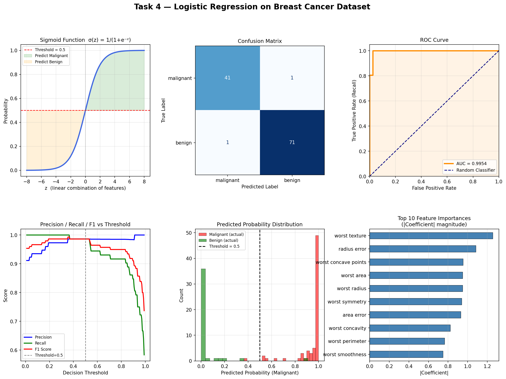

# Task 4 — Classification with Logistic Regression

**AI & ML Internship | Elevate Labs**

---

## Objective
Build a binary classifier using Logistic Regression to predict whether a tumour is **malignant** or **benign** using the Breast Cancer Wisconsin dataset.

---

## Dataset
- **Source:** Breast Cancer Wisconsin Dataset (built into `sklearn.datasets`)
- **Samples:** 569 | **Features:** 30 | **Classes:** Malignant (212) / Benign (357)

---

## Steps Performed

1. **Loaded dataset** using `sklearn.datasets.load_breast_cancer()`
2. **Train/Test split** — 80% train, 20% test with stratification
3. **Feature Standardization** using `StandardScaler`
4. **Trained Logistic Regression** model (`max_iter=1000`)
5. **Evaluated** with confusion matrix, precision, recall, F1, ROC-AUC
6. **Threshold tuning** — tested thresholds from 0.3 to 0.7
7. **Visualized** sigmoid curve, confusion matrix, ROC curve, probability distribution, and feature importances

---

## Results

| Metric     | Score  |
|------------|--------|
| Accuracy   | 98.25% |
| Precision  | 98.61% |
| Recall     | 98.61% |
| F1 Score   | 98.61% |
| ROC-AUC    | 99.54% |

---

## Visualizations



Six plots generated:
- Sigmoid function with decision boundary
- Confusion matrix
- ROC-AUC curve
- Precision / Recall / F1 vs threshold
- Predicted probability distribution
- Top 10 feature importances by coefficient magnitude

---

## Tools Used
- Python 3
- Scikit-learn
- Pandas
- NumPy
- Matplotlib

---

## How to Run

```bash
pip install scikit-learn pandas matplotlib numpy
python logistic_regression_classifier.py
```

---

## Interview Questions — Answered

**1. How does logistic regression differ from linear regression?**  
Linear regression predicts a continuous value. Logistic regression predicts the *probability* of a class (0 or 1) by passing the linear output through a sigmoid function, keeping output between 0 and 1.

**2. What is the sigmoid function?**  
σ(z) = 1 / (1 + e⁻ᶻ). It maps any real number to a value between 0 and 1, which is interpreted as a probability.

**3. What is precision vs recall?**  
- **Precision** = TP / (TP + FP) — of all predicted positives, how many were actually positive.  
- **Recall** = TP / (TP + FN) — of all actual positives, how many did we correctly catch.

**4. What is the ROC-AUC curve?**  
ROC plots True Positive Rate vs False Positive Rate at every threshold. AUC (Area Under Curve) summarises performance — 1.0 is perfect, 0.5 is random. Our model scored **0.9954**.

**5. What is the confusion matrix?**  
A 2×2 table showing TP, TN, FP, FN — giving a full breakdown of correct and incorrect predictions.

**6. What happens if classes are imbalanced?**  
Accuracy becomes misleading. Use precision, recall, F1, or ROC-AUC instead. Techniques: class weighting (`class_weight='balanced'`), oversampling (SMOTE), or undersampling.

**7. How do you choose the threshold?**  
Depends on the problem. In medical diagnosis, we lower the threshold to maximise recall (catch all positive cases), accepting more false alarms. We can plot Precision-Recall vs Threshold to find the optimal point.

**8. Can logistic regression be used for multi-class problems?**  
Yes — using **One-vs-Rest (OvR)** or **Multinomial** (softmax) strategies. Scikit-learn handles this automatically via the `multi_class` parameter.
